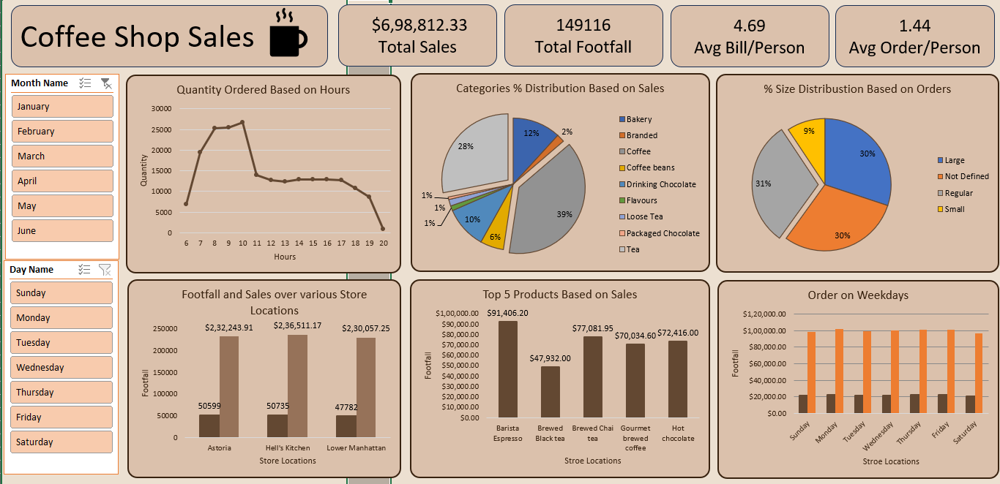
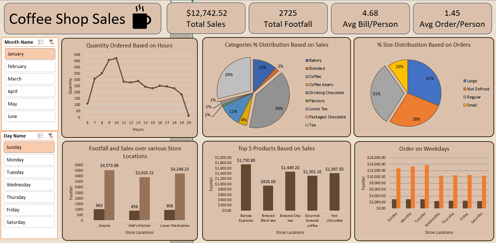
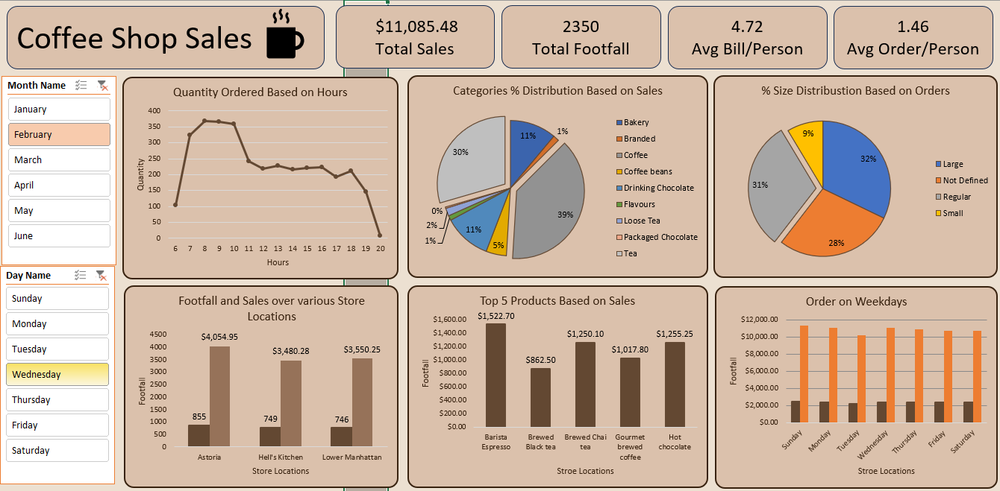

# Coffee-Shop-Sales
☕ Coffee Shop Sales Dashboard
📊 Project Overview

This project presents an interactive Excel Dashboard analyzing sales and customer data for a coffee shop chain.
The dashboard visualizes key metrics such as total sales, footfall, product performance, and category-wise sales distribution to help understand business performance at a glance.

🧾 Key Insights

* Total Sales: ₹6,98,812.33

* Total Footfall: 1,49,116 customers

* Average Bill per Person: ₹4.69

* Average Orders per Person: 1.44

📈 Dashboard Highlights

1. Quantity Ordered Based on Hours

* Shows hourly trends of customer orders throughout the day.

* Peak hours between 8 AM – 10 AM indicate strong morning demand.

2. Category % Distribution Based on Sales

* Visualizes which product categories contribute most to sales.

* Coffee leads with 39% of total sales.

3. % Size Distribution Based on Orders

* Displays the percentage of orders by cup size (Large, Regular, Small, etc.).

4. Footfall & Sales Over Store Locations

* Compares customer visits and revenue among Astoria, Hell’s Kitchen, and Lower Manhattan branches.

5. Top 5 Products Based on Sales

* Barista Espresso ranks #1 with ₹91,406.20 in sales.

6. Orders on Weekdays

* Reveals consistent customer activity across the week with minimal variation.

🧠 Tools Used

> Microsoft Excel

> Pivot Tables

> Charts & Graphs

> Slicers (for Month & Day filters)

> Conditional Formatting

🧩 Skills Demonstrated

> Data Cleaning & Preparation

> Data Visualization

> Dashboard Design

> Business Analysis

> Storytelling with Data

📷 Dashboard Preview

🚀 How to Use

> Use slicers (Month/Day filters) to interact with the data dynamically.

📌 Author

Prerna Tiwari

📧 [prernat072@gmail.com] 
💻 GitHub Profile Link: https://github.com/prerna212005
